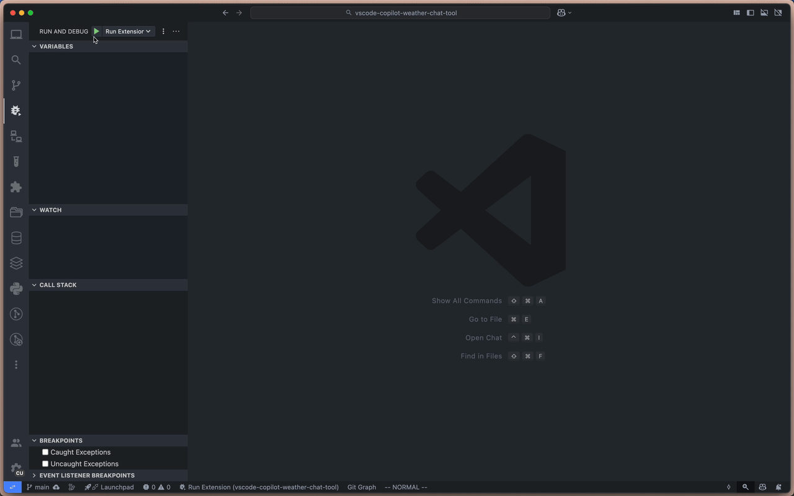

# VSCode Copilot Weather Chat Tool

A VS Code extension that adds a `weather` tool for Copilot Chat, letting you ask about the weather in any city.

## Features

- **Copilot Integration**: Ask Copilot about the weather, temperature, humidity, or wind in any city.
- **User Confirmation**: Confirms before fetching weather data.
- **Comprehensive Data**: Returns temperature, conditions, humidity, and wind speed.
- **Flexible City Input**: Supports various city formats (e.g., "London", "NYC", "New York").
- **Prompt Reference**: Use `#weather` in prompts.

## How It Works

1. Ask Copilot: "What's the weather in Paris?"
2. Copilot uses the weather tool and shows a confirmation dialog.
3. Weather info is returned and included in the chat context.
4. Follow-up questions (e.g., "What's the humidity?") are supported.



## Quick Start

```bash
npm install
npm run compile
# Open in VS Code and press F5 to run
```

## Example

```
User: What's the weather in Paris?
Copilot: Paris is currently 25°C with cloudy conditions...
User: What's the humidity?
Copilot: The humidity in Paris is 70%.
```

## Implementation Notes

- Tool registered in `registerWeatherTools()`
- Tool config in `package.json` under `languageModelTools`
